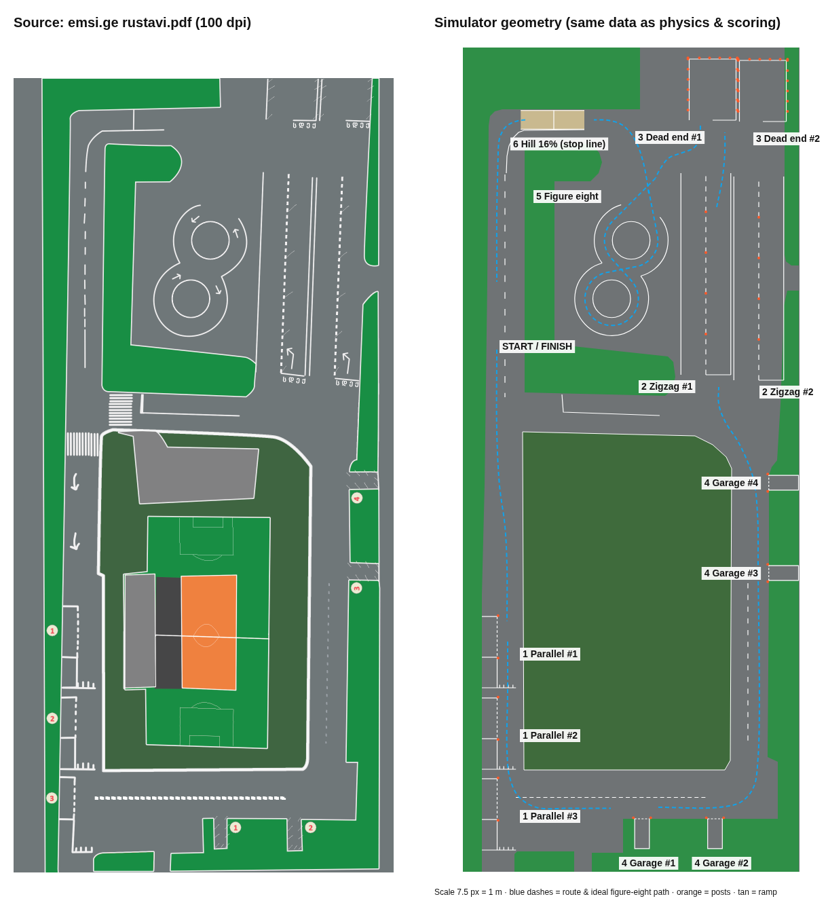

# Rustavi Driving Exam — 3D B-category Stage 1 simulator

A first-person browser simulator of the **practical driving examination ground of the Service
Agency in Rustavi, Georgia** (რუსთავის მოედანი). You sit in a left-hand-drive automatic exam car,
drive the course with realistic low-speed steering, use three rendered mirrors, perform all six
Stage 1 elements and get a **PASS / FAIL** result sheet with a chronological list of mistakes.



---

## 1. Run it

No build step and no dependencies are needed to play.

```bash
npm run dev            # = node scripts/serve.mjs 5173   (tiny static server, no deps)
# open http://localhost:5173
```

Any static server works too (`python3 -m http.server`). Three.js is vendored in `vendor/`.

Single-file build (everything inlined, ~0.9 MB — open it directly or drop it on any static host):

```bash
npm install            # only esbuild (build) and playwright (browser test) are dev dependencies
npm run build          # -> dist/index.html
```

Tests:

```bash
npm test               # 63 headless tests: physics, every element, mistake detection, scoring, restarts, checkpoints, layout
npm run test:exam      # full exam driven by the automated instructor, prints the result sheet
npm run test:browser   # Playwright: loads the app, drives, looks around, runs the whole exam, screenshots
```

---

## 2. Controls

| Key | Action |
|---|---|
| **W / ↑** | Accelerator (progressive while held) |
| **S / ↓** | Brake (progressive — hold longer to brake harder) |
| **A D / ← →** | Steer; the wheel turns at a human hand rate (full lock ≈ 1.3 s) |
| **F / R / N / P** | Gear selector: Drive / Reverse / Neutral / Park (Z/X step through P‑R‑N‑D) |
| **Q or 1 / E or 2** | Left / right indicator (press again to cancel) |
| **Space** | Parking brake on/off |
| **Mouse** | Look around (click the view to capture the mouse). Head leans when you look sideways/back |
| **C / middle mouse** | Look straight ahead |
| **Right mouse (hold)** | Zoom in — check a mirror or a pole |
| **Backspace** | Restart current exercise |
| **Esc** | Pause menu: resume, restart exercise, restart exam, checkpoints, main menu |
| **G** *(training)* | Demo driver on/off — the verified automated instructor drives the current step |
| **M** *(training)* | Minimap |
| **V** *(training)* | Outside camera |
| **F3 or `** *(training)* | Debug / calibration view |
| Gamepad | Left stick = steering wheel position, RT/LT = pedals |

While driving, a small panel at the bottom shows V / G / M (training) and Esc; active toggles are highlighted.
Checkpoints (restore the moment before or after any element reached so far) are in the Esc pause menu and on the result sheet.

The steering wheel self-centres while rolling forward (proportional to speed, not at standstill,
not in reverse — like a real car) — switchable in the menu. D and R cannot be selected while rolling the other way.

**Start of the exam:** the car stands on the left road facing south in **P with the parking brake
on**. Brake, select **D**, release the parking brake, signal **left**, move off.

---

## 3. Modes

**Training** — contextual instructions for every step ("Stop. Turn the wheel fully RIGHT", distance
read-outs, target angles), ideal trajectories drawn on the ground, a ghost car at ideal stopping
positions, highlighted boundary lines, route chevrons, minimap, **reference stickers** (below) and
a demo driver. Mistakes are explained (Georgian rule text) and the run continues
after a disqualifying mistake.

**Exam** — no assistance at all (no text, paths, minimap, debug or outside camera). The electronic
examiner still announces each mistake with a chime, like the automated system on the real ground.
A disqualification or more than 39 penalty points ends the exam immediately.

### Reference-point training (reference stickers)

Driving schools stick marks on the car where a pole appears at the right moment. The simulator does
the same with real geometry: for each key moment the coach computes the **ideal car pose** from the
turning radius (e.g. where full right lock must start in parallel parking), projects the target pole
through the **same mirror-camera model the renderer uses** (`src/sim/optics.js`) and places a
yellow sticker on that mirror (or on the glass along the eye ray). When the pole in the live mirror
image reaches the sticker, the geometric condition is met and the instruction changes; the HUD tag
turns green ("Aligned with the reference point"). Nothing is faked — change the car, the mirrors or
the course and the stickers move with them.

### Debug / calibration view (training only)

Shows the vehicle footprint, wheel contact points and mirror points, every scored boundary line,
the figure-eight outer arcs and opening, posts, fences, ramp walls and kerbs, the invisible route
checkpoints, one-way zones and the finish area, plus live telemetry: position in metres **and in
PDF map pixels**, heading, pitch/roll, steering wheel/road-wheel angle and turning radius, pedals,
contacts, current element/station/phase, evaluator internals and the last violations.

---

## 4. How the PDF was read

The attached PDF (emsi.ge, "რუსთავის პრაქტიკული მოედნის თანმიმდევრობა") is a single raster map
without a scale bar or element labels. All geometry is traced from it at 100 dpi and stored in map
pixels in `src/courses/rustavi/course.js`, so every coordinate can be checked against
`docs/rustavi-map.png`.

| Map feature | Interpretation | Why |
|---|---|---|
| 3 numbered boxes on the left road, each with a comb-shaped line | **Parallel parking** bays 1–3 (on the right when driving south). The comb line is the stop line ("სდექ-ხაზი") at which you stop before reversing into the bay behind. | Dashed outer edge = entry side; solid-edged zone ahead of the space; stop line across the lane. |
| 4 numbered hatched pockets (1–2 south, 3–4 east) | **Reverse parking / garage** boxes cut into the kerbed lawns | Box-sized pockets (≈ 3.0 × 5.9 m) with station numbers, like the parallel bays. |
| Two lower lanes top-right, stop line + "სდექ" on the right half, a white arrow bending left, ticks every ≈ 8 m on the centre line | **Zigzag** lanes 1–2. The ticks are the centre posts ("სადგარები"). | The rules say the first centre post is passed on its left "as shown by the white arrow painted on the road". |
| Two upper lanes (beyond a gap) with a stop line on the right half, dense ticks along both edges, running off the top of the page | **Limited-width turn / dead end (ჩიხი)** 1–2. The lanes end at the ground's north edge; the edge ticks are posts. | "Start from the right side (stop line) … exit on the left side, opposite to the entry" matches a stop line covering only the right half of a dead-end lane. |
| Figure eight with arrows | **Figure eight**: top loop anticlockwise, bottom loop clockwise, single opening in the top loop's outer line | Drawn explicitly. Entering through the western half of the opening = "start from the right side", leaving through the eastern half = "exit on the left side". |
| One-way lane at the top-left crossed by a single short line | **Hill (16 %)**, westbound, stop line near the crest | The only remaining lane with a stop line. Traffic in it must be westbound (right-hand traffic), so it has to be westbound for the loop to close. |
| Arrows ↓ on the left road; loop around the stadium | **Route**: start on the left road → Parallel → Garage → Zigzag → Dead end → Figure eight → Hill → back to start | Follows the one-way arrows and right-hand traffic; each element is entered from its approach direction. |

**Scale calibration.** 7.5 px = 1 m (`METERS_PER_PX = 2/15`). With it, the pockets are 2.5–3.5 × 5.9 m
(garage-sized), roads 7.3–9.6 m, the figure-eight lane 3.55 m and the zigzag posts 8 m apart. A larger
scale would make pocket 1 narrower than a car. One constant rescales the whole ground.

### Assumptions (all configurable)

| Item | Value | Basis | Where |
|---|---|---|---|
| Map scale | 7.5 px / m | calibration above | `course.js` `METERS_PER_PX` |
| Map orientation | all lines axis-aligned | PDF is hand-drawn with ~1–2° skew | `course.js` |
| Parallel space | 8.0 × 3.0 m, front zone 6.0 m, comb line 6.7 m | measured (bays 2 & 3; bay 1 is drawn longer) | `COURSE_DIMS` |
| Garage box | 3.0 × 5.9 m (pockets normalised) | measured 2.5–3.5 × 5.9–6.1 m | `COURSE_DIMS` |
| Zigzag | lane 9.8 m wide, 4 posts at 8/16/24/32 m after the stop line, plus a start post at the left end of the stop line | measured ticks (0/8.4/15.9/24.1/33.2 m) | `COURSE_DIMS`, `zigzag.js` |
| Dead end | 9.2 m wide, 8.2 m deep; side posts at 0.3 / 3.8 / 6.2 m + corner posts, 0.25 m outside the lines; one shared row between the two boxes | width and post ticks from the 300 dpi PDF (lines reach the page edge at 8.15 m); satellite image gives ~7.8 m depth | `COURSE_DIMS` |
| Figure eight | inner circles r = 3.7 m, outer r = 7.25 m, centres 12.1 m apart; posts on the lines ~2.9 m apart (8 per inner circle, the outer line, none across the opening) | measured; posts from MIA order 598 annex 4 | `COURSE_DIMS`, `course.js` |
| Hill | 16 % incline over 6.5 m (1.04 m high), 1.5 m plateau, 4.5 m descent (23 %), lane 3.87 m, stop line 0.5 m below the crest | 16 % from the spec; lengths limited by the space before the corner | `COURSE_DIMS` |
| Posts | striped poles r = 5.5 cm, 1 m high; parallel & garage corner posts added | rules mention posts for these elements | `COURSE_DIMS`, element modules |
| Ground extension | 6 m north of the page edge | originally for the dead ends (now 8.2 m deep, ending at the page edge) | `course.js` boundary |
| Stations | default training guidance uses station 1 of each element; any station is detected and scored | — | exercise modules |
| Start/finish | left road (map px 92,400) facing south | loop closure after the hill | `course.js` route |

---

## 5. Scoring

`src/config/examRules.js` holds every value.

* **100 points, pass with no more than 39 penalty points, 2 minutes per element.** Source: drv.ge FAQ,
  martiviteoria.ge and imedinews.ge, all citing MIA Order No. 598.
* **Per-element requirements and points.** Source: the crystalauto.ge driving-school article, which
  reproduces the official list. Each rule carries its Georgian text (`ka`). The legal text on
  matsne.gov.ge could not be retrieved, so these values should be checked against the official annex.
* Rules not found in any source are flagged `official: false` and shown as "simulator rule". They
  are indicator use (−5), contact with obstacles outside an element (−5) and driving against the
  course direction (−10). Each one can be switched off with `enabled: false`.

| Element | Mistake | Points |
|---|---|---|
| Parallel | stop line crossed when stopping (value missing in source → 10 assumed) · marking/post in zone · marking/post on exit · not fully inside · no parking brake | 10 · 10 · 15 · 20 · 15 |
| Zigzag | first post not passed on its left · not weaving between posts · marking/post · stopping · engine off · reversing | 15 · 15 · 15 · 10 · 15 · 10 |
| Dead end | not starting on the right (stop line) · more than one reverse · marking/post · leaving the zone · exit not on the left | 15 · 15 · 20 · **DQ** · **DQ** |
| Garage | rolling > 30 cm · reverse engaged more than once · not fully inside · marking/post | 10 · 15 · 15 · 20 |
| Figure eight | start not on the right · exit not on the left · stopping · engine off · wheel on a line · reversing · wrong direction / incomplete loops | 15 · 15 · 5 · 15 · 15 · 15 · **FAIL** |
| Hill | not stopped ≥ 1 m before the stop line (or crossed it) · rollback > 20 cm · rollback > 1 m (sim rule) | 20 · 10 · **FAIL** |
| Any | time limit 2:00 exceeded · element skipped | **FAIL** |

Each rule counts once per element attempt (configurable with `repeatable`).

**Hill stop wording.** The source says the car must stop "not less than one metre" before the stop
line (`stopMinDistance: 1.0`), and the car must be fully on the incline. If the real rule means "at
most 1 m", set `stopMinDistance: 0` and `stopMaxDistance: 1.0`.

**What is measured (no checkpoint cheating).**
* Lines are judged by the actual tyre contact patches (contact point ± half tyre width) against the
  painted segments and arcs.
* "Fully inside" uses the body outline (corners + edge midpoints) at the final standstill.
* Posts, fences and ramp walls are solid colliders against the body rectangle and the mirror points.
* Kerbs are hit by the tyre edges.
* The zigzag checks which side of each post the car's centre is on as it passes.
* The figure eight accumulates the angle swept around each loop centre, in the required direction
  and order (top → bottom → top), and checks where the car crosses the opening.
* The hill stores the stopping position along the slope and measures the rollback from it.
* Reverse moves, direction changes and rolling against the selected gear are tracked from the
  vehicle's velocity.
* Route checkpoints are only used to detect skipped elements and to guide training.

---

## 6. Vehicle & physics

`src/config/vehicle.js`: length 4.35 m, width 1.78 m (2.02 m with mirrors), wheelbase 2.60 m,
track 1.52 m, overhangs 0.88 / 0.87 m, max road-wheel angle 34.5° → kerb-to-kerb turning circle
≈ 10.4 m, steering ratio 15.5 (≈ 535° to full lock), mass 1330 kg.

`src/sim/vehicle.js`, integrated at a fixed 120 Hz:
* **Steering.** Kinematic bicycle model referenced to the rear axle, with yaw rate = v·tan δ / L.
  At 0–20 km/h this reproduces real turning radius, rear-wheel cut-in and front-overhang swing. The
  front wheels are drawn with Ackermann angles.
* **Automatic transmission.** Torque-converter creep of about 6.3 km/h in D and 4.9 km/h in R. Brake
  force always overrides creep. Off the accelerator above creep speed the idling engine brakes the
  car (up to 900 N): from 20 km/h it is back to ~10 km/h after 4 s, then settles at creep.
* **Longitudinal forces.** Throttle force with a power limit, brakes and parking brake modelled as
  static/kinetic friction (they hold the car), rolling resistance, drag, and gravity from the
  pitch computed from the terrain under all four wheels.
* **Hill.** The creep force (1550 N) is smaller than the gravity pull on 16 % (≈ 2060 N), so an
  unbraked car in D rolls back, exactly the situation the hill start tests.
* **Collisions.** When a move would overlap a solid collider, the car is stopped at the last free
  pose and the contact is recorded once (debounced).

---

## 7. Architecture

```
src/
  config/vehicle.js, examRules.js     central, editable parameters
  courses/index.js                    course registry (add Tbilisi, Gori, Kutaisi, Batumi … here)
  courses/rustavi/course.js           Rustavi data: lawns, fences, markings, stations, route, signs
  sim/            (pure JS, no rendering — runs in Node for tests)
    vehicle.js    physics            world.js      colliders, kerbs, terrain, marking list
    exam.js       exam state machine, scoring, restarts, PASS/FAIL
    exercises/    parallel, zigzag, turn (dead end), garage, figure8, hill:
                  geometry builder + evaluator + training coach per element
    assistant.js  training guidance + reference stickers     optics.js  eye & mirror geometry
    driver.js     path tracking + automated driver (demo & tests; drives through the same inputs)
    simulation.js facade used by the app and the tests
  render/         three.js: world3d (ground, lawns, markings, ramp, posts, signs), car3d (exterior,
                  cockpit, dashboard canvas), mirrors (render targets), overlays3d (training & debug)
  ui/             HUD, guidance card, toasts, minimap, debug panel, result sheet, styles
  audio/          procedural WebAudio (engine, tyres, indicator relay, impacts, clicks, chimes)
  input.js        keyboard / mouse / gamepad        main.js   bootstrap & loop
tests/            test-suite.mjs, run-exam.mjs, browser-test.mjs
tools/course-map.html  renders docs/course-interpretation.png from the live course data
```

**Adding a location:** copy `courses/rustavi/course.js`. Trace lawns, fences and markings. Place
stations as `{ o: origin, f: approach direction }` and set the sequence, route legs and restart
poses. The element modules are location-independent because they work in each station's local frame.

---

## 8. Known limitations

* The PDF has no dimensions, so every size comes from the calibrated scale or the assumptions table.
  Check them on site and adjust `COURSE_DIMS`.
* Per-element penalties come from a secondary source (see §5).
* Mirrors are fixed virtual cameras placed at the glass, not per-pixel reflections of the head
  position. The right mirror dips in R.
* The driver-side geometry is left-hand drive only.
* There is no engine stall (automatic gearbox) and no engine switch, so the engine-off rules of the
  zigzag and the figure eight cannot trigger.
* Training guidance leads to station 1 of each element. Other stations are fully scored but
  coached only after you enter them.
* Software-rendered (no GPU) browsers run at a low frame rate. Add `?lowgfx` to the URL for lower
  mirror resolution and no shadows.
